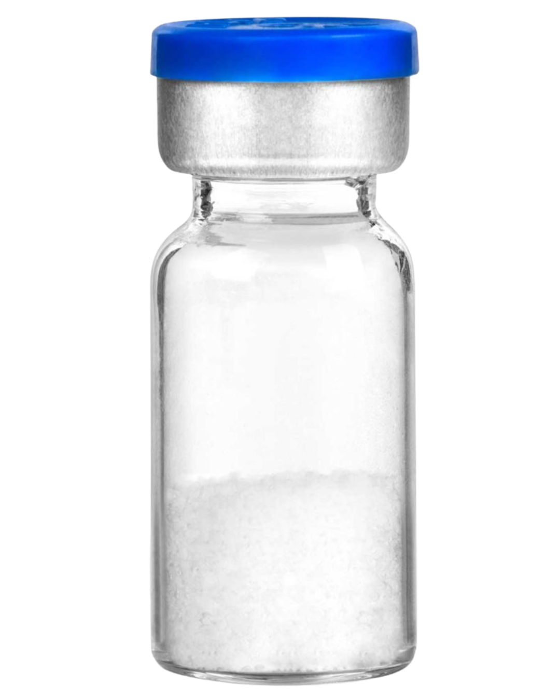

# What Are Peptides

!!! success "Simple definition"
:lucide-atom: **Peptides are short chains of amino acids** → basically tiny proteins that act like messenger molecules in your body.

:lucide-flame: They tell your cells to heal faster, burn fat, build muscle, produce collagen, and more.

:lucide-test-tube: Most peptides you see online arrive as **freeze-dried (lyophilized) white powder** in small glass vials. This form stays stable even in hot and humid Philippine weather.

---

## Why Are Peptides So Popular in the Philippines?

!!! tip "Most common reasons people start"

- Rapid weight loss ([tirzepatide](../weightloss/tirzepatide.md "Tirzepatide - dual action weight loss"), [retatrutide](../weightloss/retatrutide.md "Retatrutide - triple action weight loss"), [semaglutide](../weightloss/semaglutide.md "Semaglutide - GLP-1 weight loss"))
- Faster recovery from injuries or workouts ([BPC-157](../peptides/bpc-157.md "BPC-157 - body protection compound"), [TB-500](../peptides/tb-500.md "TB-500 - thymosin beta-4"))
- Younger-looking skin & thicker hair ([GHK-Cu](../peptides/ghk-cu.md "GHK-Cu - collagen and skin health"), collagen peptides)
- Better sleep and energy ([CJC-1295](../peptides/cjc-1295.md "CJC-1295 - growth hormone releasing hormone"), [ipamorelin](../peptides/ipamorelin.md "Ipamorelin - growth hormone secretagogue"))
- Stronger immune system & reduced inflammation

---

## Why Do They Come as Powder in a Vial?

{ width=40px align=left }
!!! tip "Super practical for Philippines"

- Lasts 2+ years at room temperature → no problem with brownouts
- Cheap and light to ship anywhere in the country
- Easier to clear customs (labeled “research use only”)
- Won’t spoil even if courier is delayed a few days

After you mix with bacteriostatic water → keep in the fridge (good for 4–6 weeks).

---

## Why Do Most Peptides Need to Be Injected?

!!! tip "It’s the only way they actually work"

- Many peptides are destroyed by stomach acid if you swallow them
- Tiny subcutaneous injection (into the fat) → goes straight into the blood → nearly 100 % absorption

**Good news**: the needle is an ultra-thin insulin syringe (30G–31G).  
Most people say it hurts **less than plucking eyebrows or a mosquito bite**.  
After the first few times you won’t even feel it.

---

<!-- prettier-ignore -->
!!! success "Bottom line"
    Peptides are stable, powerful, and safe **WHEN USED CORRECTLY**.
