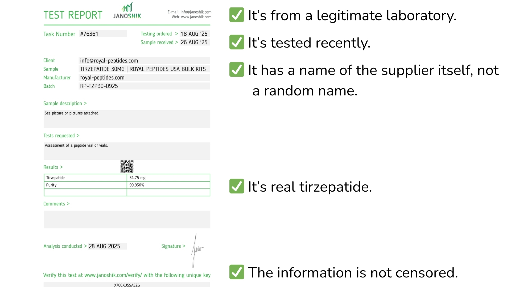
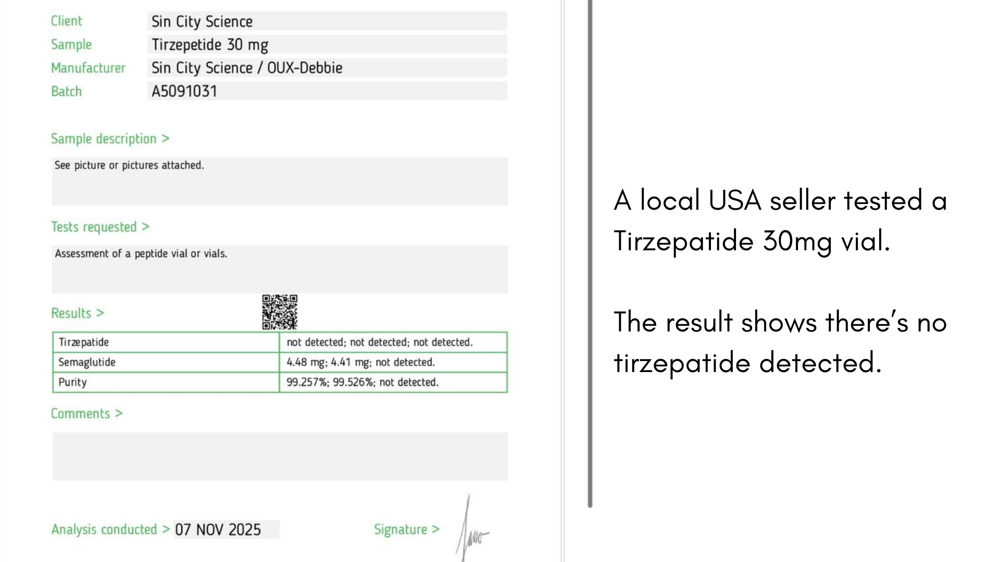
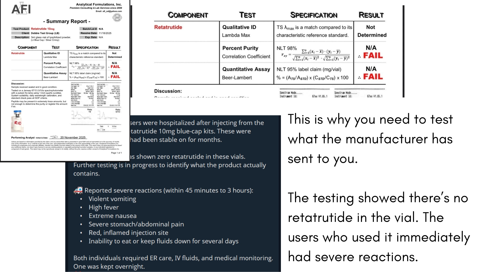
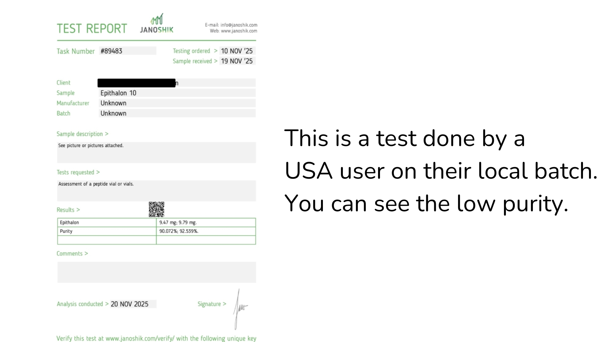
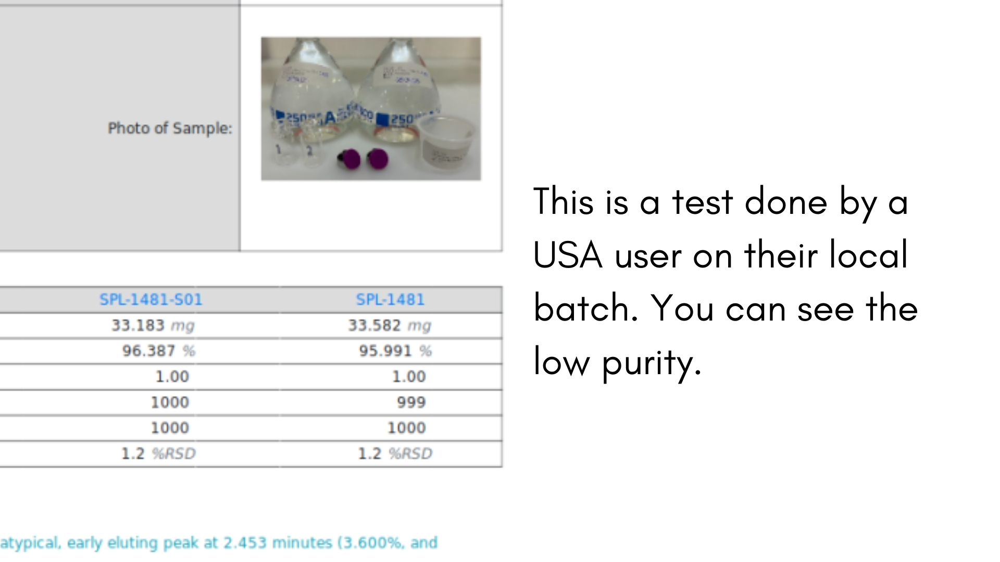
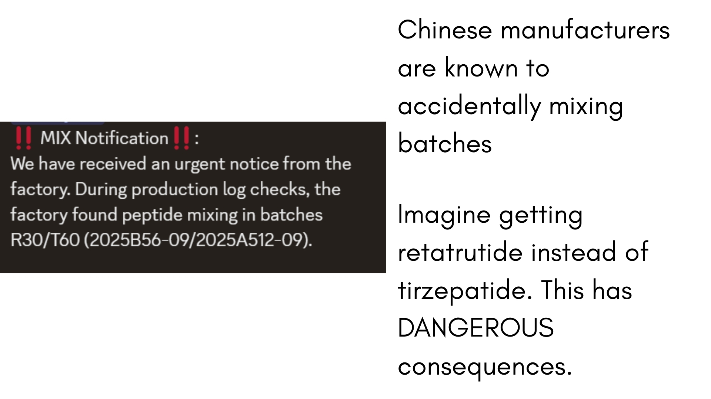
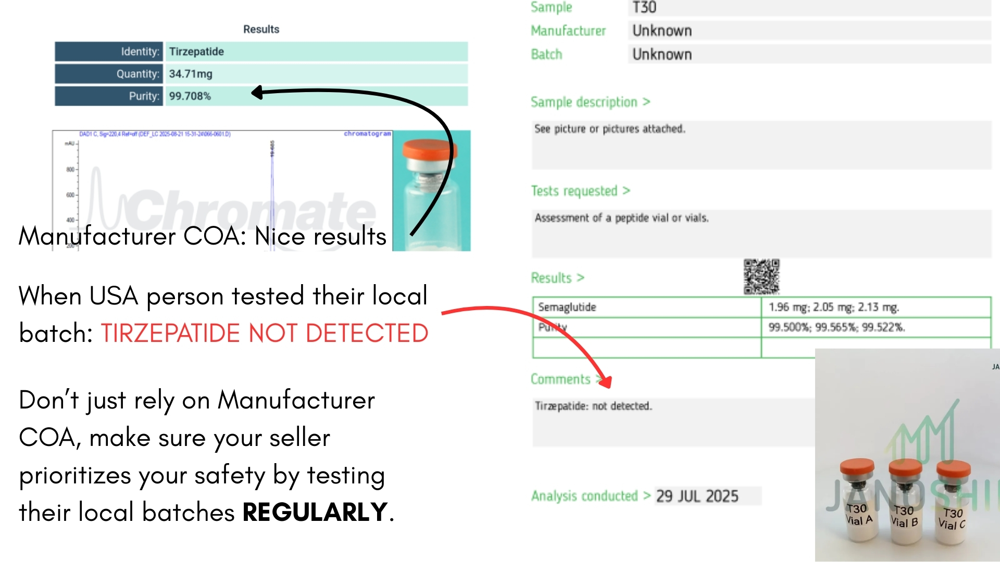
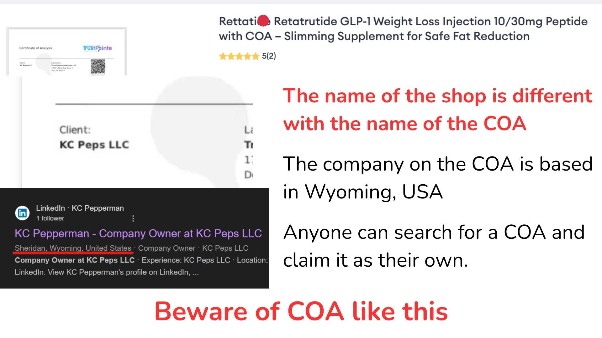

# Why COA is Important

## What is a Certificate of Analysis (COA)?

A **COA** is a **lab report** that shows what is inside a vial.

It lists:

- [x] Purity
- [x] Identity
- [x] Concentration

With a COA, you can see that:

- [x] It's the correct peptide
- [x] It's not a fake product
- [x] It's not degraded
- [x] It's not old stock

Even FDA-registered peptide companies in the USA must provide a COA.

## What Should I Look For in a COA?

The COA presented should have:

??? tip "The name of your supplier"

    The name on the COA should exactly be the name of your supplier, either a business name or their personal name. Not "Pure Peptides USA" or "Li Shung Peptide". Your local seller should ideally send an _actual vial_ to a lab, representing their local stock. This is so that you know what's the white powder in the vial.

??? tip "Recent date (within the last 12 months)"

    We highly encourage the local sellers to routinely test their stock every restock.

??? tip "Legitimate laboratory and not just a made-up website"

    Some sellers have created fake websites or documents. Please check the compiled [list of legitimate labs](resources/trusted-labs.md).

??? tip ">99% Purity"

    The purity should be more than 99%.

_For example, you are in the USA and you want to order from Royal Peptides_

!!! quote "THESE ARE ALL THE BARE MINIMUM."

    We highly recommend the local sellers to always test their product so they can guarantee the safety of their users. Scroll down below and see the consquences if we don't test our products.

## Is Manufacturer COA Okay?

For the sake of **harm reduction and the safety of the community**, we strongly recommend the local sellers to ALWAYS test their products and not rely on "Manufacturer COA".

**We are dealing with white powder in vials here.**

Your supplier should **ensure your safety** and make sure that whatever he or she received from CHINA is indeed a legitimate peptide, and not baking soda or table salt.

If they say the following:

??? failure "We only have manufacturer COA"

    This should not be a valid excuse.

    Manufacturers are known to:

    - Mix up their vials (e.g. label semaglutide as tirzepatide)
    - Send old degraded stock
    - Send the wrong vials
    - Send in contaminated batches

    You cannot rely on Manufacturer COA alone. We highly encourage local sellers to test their local batch to ensure that it's not mixed up, it's not old degraded stock, it's not wrong vials, and it's not contaminated batches.

??? failure "We don’t have COA under our shop name, but our manufacturer is really good!"

    This should not be a valid excuse.

    Manufacturers are known to:

    - Mix up their vials (e.g. label semaglutide as tirzepatide)
    - Send old degraded stock
    - Send the wrong vials
    - Send in contaminated batches

    You cannot rely on Manufacturer COA alone. Why can't the seller do the effort of testing so they can secure the safety of their customers?

??? failure "Third-party testing is too expensive, we don't have enough profit"

    This should not be a valid excuse.

    As sellers they should prioritize the health of their buyers.

??? failure "I'm a seller but I am using my own peptides, I did not test pero I am still alive "

    This should not be a valid excuse.

    See examples below. Would you wait for a catastrophe to happen before we start testing?

??? failure "A COA is not a guarantee that it's safe! What if they have 1000 vials and they only test 1?!"

    This should not be a valid excuse.

    A local seller doing a COA is the **bare minimum**. If you think the seller is selling 1000 vials, then please encourage them to test more vials.

    Manufacturers also create millions of vials and they also only test 1.

We consider these answers as excuses.

- To sellers: Please prioritize the health and safety of your buyers, test the batches your receive to ensure it's healthy to consume.

- To buyers: Please do not accept excuses and urge your sellers to test. You deserve the peace of mind.

If you still push through, please accept the possible risks.

## The Risks of Not Getting Own COA

- Chinese manufacturers are known to accidentally mix up batches, sending the wrong peptide to customers
- Chinese manufacturers frequently send degraded or contaminated batches that pass initial checks
- Vials can be mislabeled during manufacturing, leading to dangerous mix-ups between different peptides
- What arrives at your local seller may not match what the manufacturer's COA claims
- Without local testing, you have no way to verify the contents of the white powder in your vial

---

---

---

---

---

---

---

## At the End of the Day, It's Your Choice

We get it. You will always hear stories online saying their supplier doesn't have a COA but their product works better. Or they say the tested stuff is actually weaker.

We understand why people feel this way. We are just here to explain and recommend.

But here is the truth: if you don't test, you don't know what you are putting in your body. You might get lucky and get the real thing. Or you might get fake stuff or something dangerous. You won't know until something bad happens.

COA doesn't guarantee everything is perfect. But it gives you proof. It gives you peace of mind. It gives you something to go back to if something goes wrong.

**The choice is yours. But choose wisely. Your health is more important than saving a few hundred pesos.**
