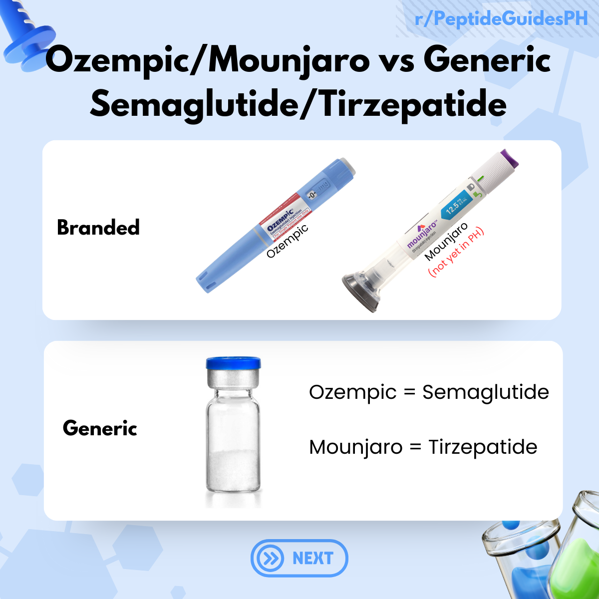
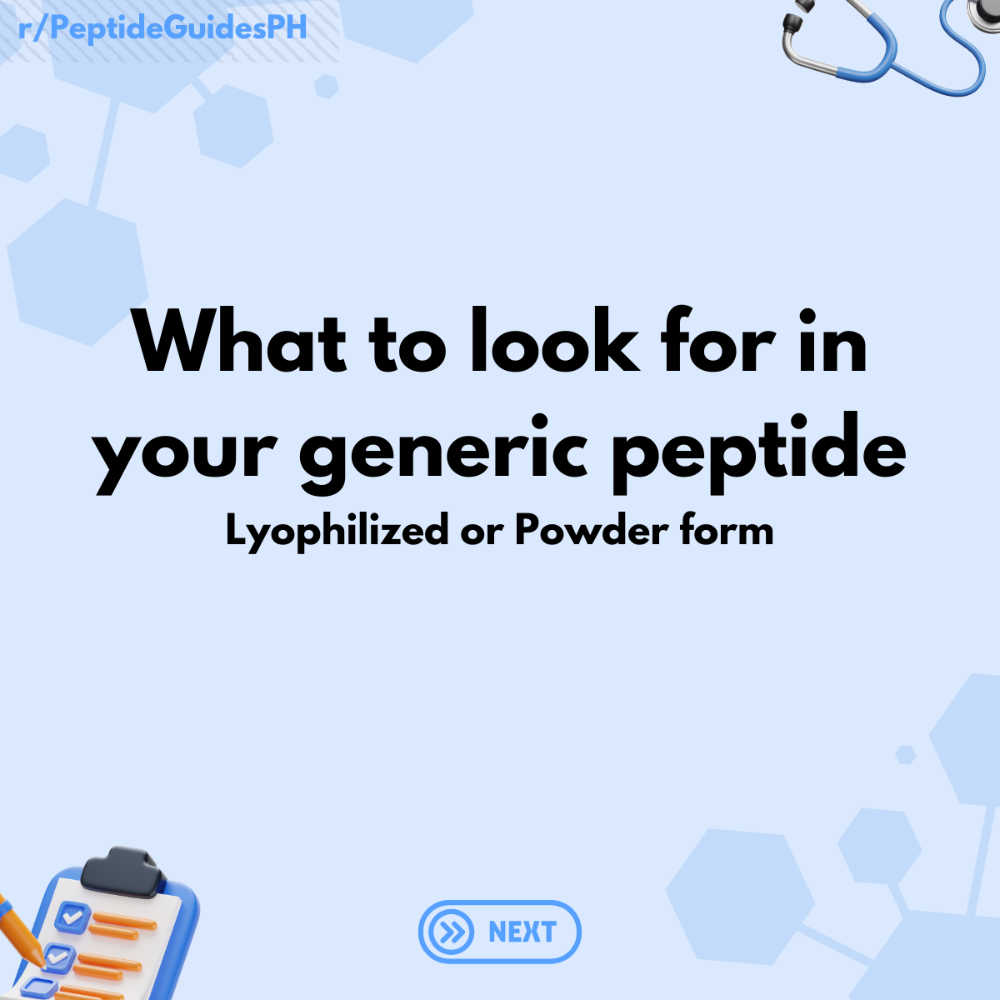
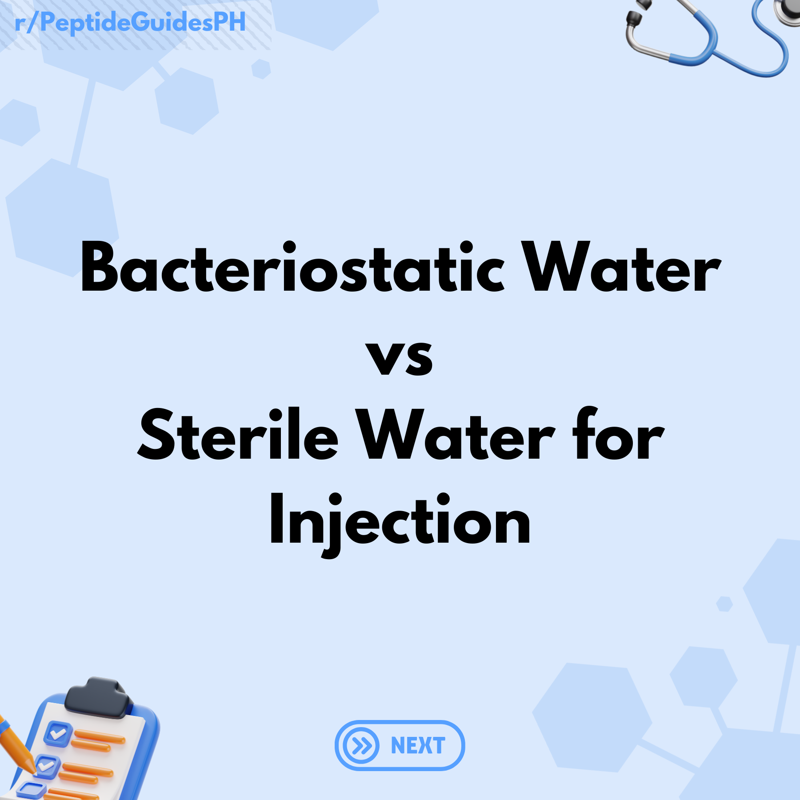
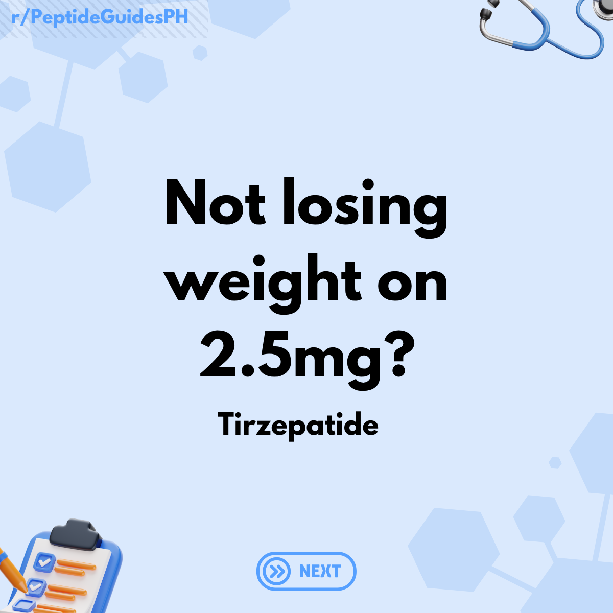

# Frequently Asked Questions

<!-- prettier-ignore -->

- [{ align=left }  
  **Ozempic/Mounjaro versus Generic**](faq/ozempicvsgeneric.md)
- [{ align=left }  
  **What to look for in Lyophilized or Powder Form Peptides**](faq/lyophilizedpeps.md)
- [{ align=left }  
  **What to look for in Reconstituted or Liquid Form Peptides**](faq/reconnedpeps.md)
- [{ align=left }  
  **Bacteriostatic Water vs Sterile Water**](faq/bacvssterile.md)
- [{ align=left }  
  **Best Time to Inject GLP-1**](faq/besttime.md)
- [{ align=left }  
  **Not Losing Weight on 2.5mg Tirzepatide?**](faq/notlosingweight.md)

